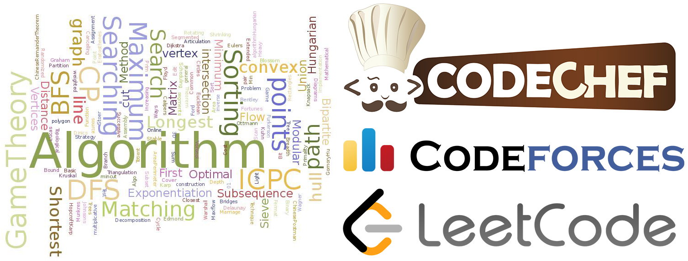

# Competitive Programming

<<<<<<< Updated upstream
  
=======
  
>>>>>>> Stashed changes

These are my solutions to live competitive programming contests from [Codechef](https://www.codechef.com), [CodeForces](https://codeforces.com) and [LeetCode](https://leetcode.com)

If you have any questions about the solutions, feel free to contact me **sharmaishan747@gmail.com**.
